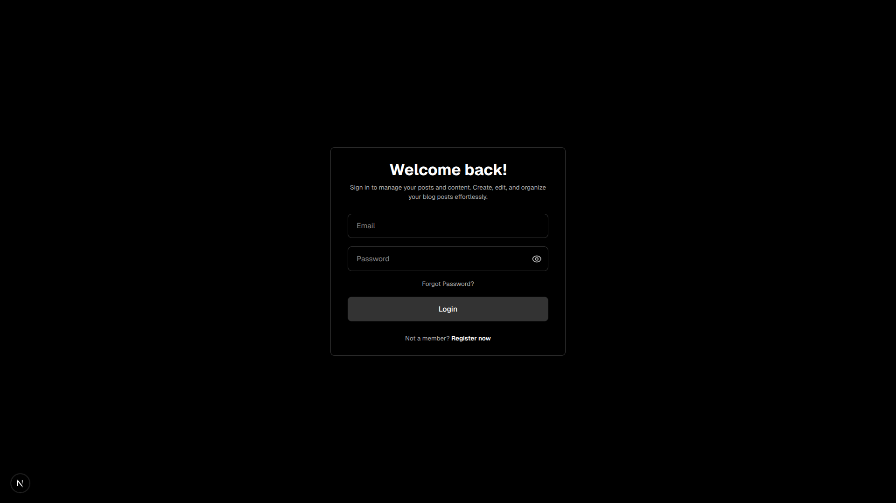
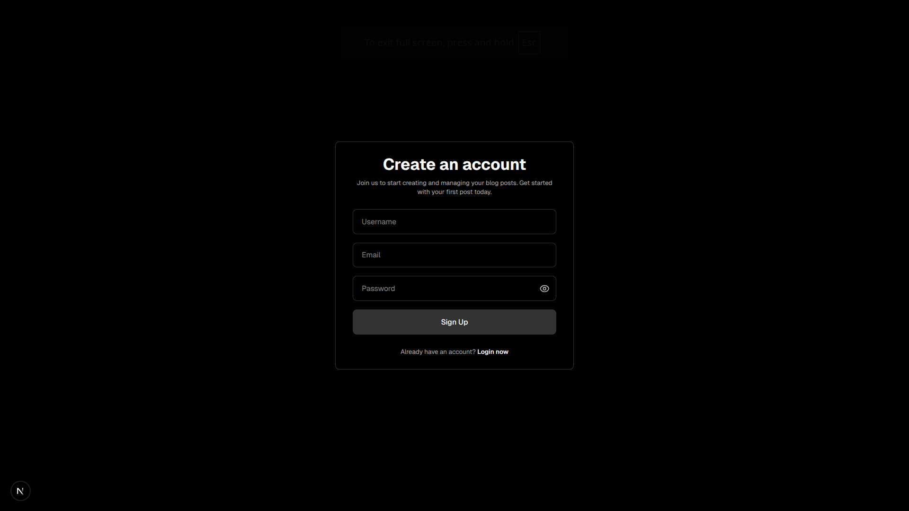
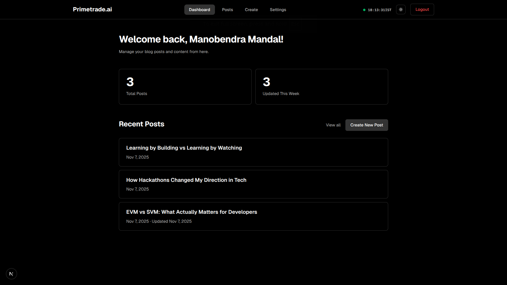
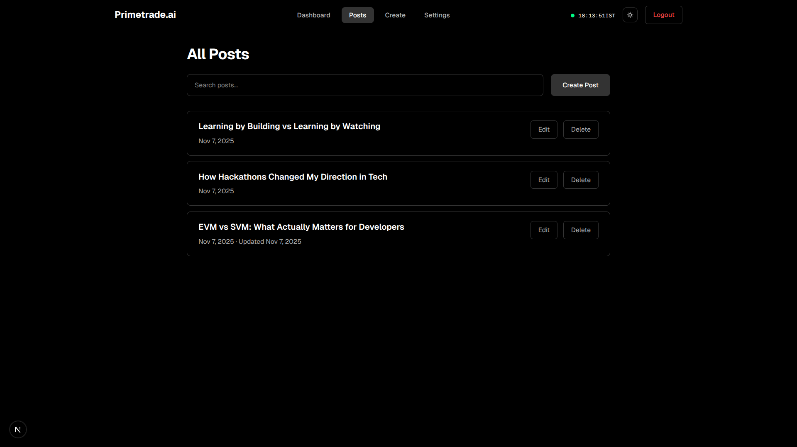
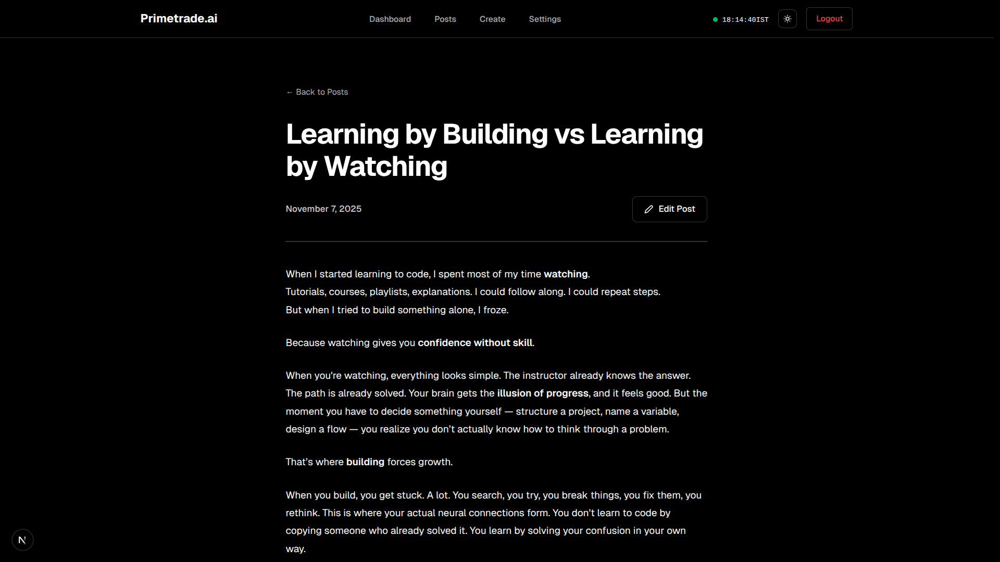
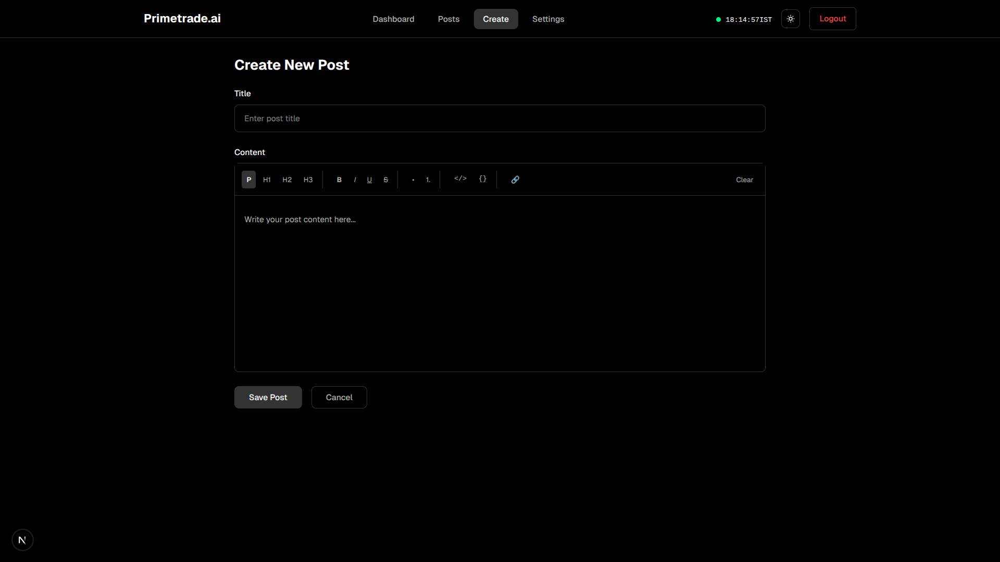
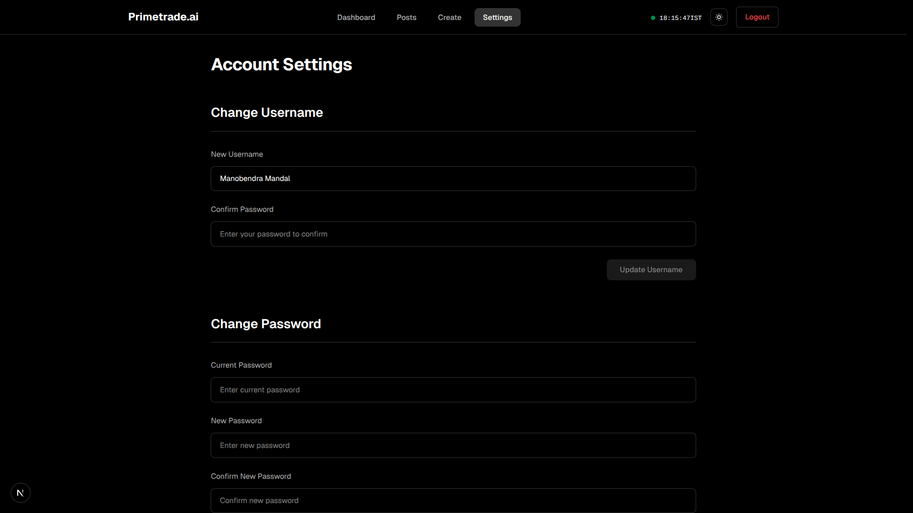

# Primetrade.ai Frontend Developer Assignment

A full-stack web application built with Next.js and Node.js/Express featuring JWT authentication, dashboard, and CRUD operations for blog posts.

**Repository**: [https://github.com/manovHacksaw/Primetrade.ai-frontend-task](https://github.com/manovHacksaw/Primetrade.ai-frontend-task)

**Live Demo**: 
- **Frontend**: [https://primetrade-ai-frontend-task.vercel.app/](https://primetrade-ai-frontend-task.vercel.app/) (Vercel)
- **Backend API**: [https://primetradeai-frontend-task-production.up.railway.app/](https://primetradeai-frontend-task-production.up.railway.app/) (Railway)

## 📸 Screenshots

| Login | Signup | Dashboard |
|-------|--------|-----------|
|  |  |  |

| Posts List | Post View | Create Post | Settings |
|------------|-----------|-------------|----------|
|  |  |  |  |

## ✨ Features

### Frontend
- **Next.js 16** with React 19 and TypeScript
- **Responsive Design** using TailwindCSS
- **Dark/Light Theme** support with system detection
- **Form Validation** (client-side and server-side)
- **Protected Routes** with authentication checks
- **Rich Text Editor** (TipTap) for post content
- **Search & Filter** functionality
- **Smooth Animations** with Framer Motion

### Backend
- **Node.js/Express** REST API
- **MongoDB** with Mongoose ODM
- **JWT Authentication** with secure token management
- **Password Hashing** using bcrypt (10 rounds)
- **Protected API Routes** with middleware
- **Comprehensive Error Handling** and validation
- **Request Logging** to track all API calls

### Core Functionality
- ✅ User registration and login
- ✅ User profile management (username/password update)
- ✅ Full CRUD operations for posts
- ✅ Dashboard with statistics and recent posts
- ✅ Real-time search and filtering
- ✅ Secure logout functionality

## 🏗️ Project Structure

```
prime-trade-assignment/
├── client/                 # Next.js frontend
│   ├── app/               # App router pages
│   ├── components/        # React components
│   └── lib/               # Utilities (auth, axios)
├── server/                # Express backend
│   ├── src/
│   │   ├── routes/        # API endpoints
│   │   ├── models/        # MongoDB models
│   │   ├── middleware/    # Auth & logging middleware
│   │   └── config/        # Database config
│   └── logs/              # Access & error logs
├── screenshots/           # UI screenshots
└── postman/               # Postman collection & results
```

## 🚀 Quick Start

### Prerequisites
- Node.js (v18+)
- MongoDB (local or Atlas)
- npm or yarn

### Backend Setup

```bash
cd server
npm install

# Create .env file
cat > .env << EOF
MONGO_URI=mongodb://localhost:27017/primetrade
JWT_SECRET=your-secret-key-here
PORT=5000
EOF

npm run dev
```

Backend runs on `http://localhost:5000`

### Frontend Setup

```bash
cd client
npm install

# Create .env.local file
echo "NEXT_PUBLIC_API_URL=http://localhost:5000" > .env.local

npm run dev
```

Frontend runs on `http://localhost:3000`

## 📚 API Documentation

### Endpoints Overview

**Authentication**
- `POST /auth/register` - Register new user
- `POST /auth/login` - Login user
- `GET /auth/me` - Get current user (protected)

**Posts**
- `GET /posts` - Get all user's posts (protected)
- `GET /posts/:id` - Get single post (protected)
- `POST /posts` - Create post (protected)
- `PUT /posts/:id` - Update post (protected)
- `DELETE /posts/:id` - Delete post (protected)

**User**
- `PATCH /user/username` - Update username (protected)
- `PATCH /user/password` - Update password (protected)

## 🔒 Security

- **Password Hashing**: bcrypt with 10 salt rounds
- **JWT Tokens**: Secure token-based authentication
- **Route Protection**: Frontend and backend route guards
- **Input Validation**: Client and server-side validation
- **CORS**: Configured for secure cross-origin requests
- **Error Handling**: Comprehensive error management

## 📋 Logging

The application includes comprehensive logging:

- **Access Logs**: `server/logs/access-YYYY-MM-DD.log`
  - Timestamp, HTTP method, route, status code, response time
  
- **Error Logs**: `server/logs/error-YYYY-MM-DD.log`
  - Timestamp, request details, error message, stack trace

Logs are automatically generated when the server is running. Access logs track all HTTP requests, while error logs capture exceptions and stack traces.

## 🧪 Testing

### Manual Testing
1. Start both servers (backend + frontend)
2. Navigate to `http://localhost:3000`
3. Register a new account
4. Test all CRUD operations
5. Test search and filtering
6. Update profile settings

### Postman Collection
1. Import `Postman_Collection.json` into Postman
2. Set `base_url` environment variable to `http://localhost:5000`
3. Run the collection to test all endpoints
4. Export results to `postman/run-report-YYYY-MM-DD.json`

## 🚀 Production Deployment

**Live Application**: 
- **Frontend**: [https://primetrade-ai-frontend-task.vercel.app/](https://primetrade-ai-frontend-task.vercel.app/) (Vercel)
- **Backend API**: [https://primetradeai-frontend-task-production.up.railway.app/](https://primetradeai-frontend-task-production.up.railway.app/) (Railway)

**Deployment Setup:**
- **Frontend**: Next.js application deployed on Vercel
- **Backend**: Node.js/Express API deployed on Railway
- **Database**: MongoDB Atlas (cloud-hosted)
- **Environment Variables**: Configured for production on both platforms

**Key Considerations:**
- Environment variables for secrets
- HTTPS enforcement
- Rate limiting
- Database indexing
- Redis caching
- CDN for static assets
- Monitoring and logging
- Horizontal scaling

## 📦 Tech Stack

**Frontend**
- Next.js 16, React 19, TypeScript
- TailwindCSS, Framer Motion
- TipTap (Rich Text Editor)
- Axios

**Backend**
- Node.js, Express.js
- MongoDB, Mongoose
- JWT, bcrypt
- CORS, dotenv

## 📄 Deliverables

- ✅ Frontend (Next.js) + Backend (Node.js/Express)
- ✅ Functional authentication (register/login/logout with JWT)
- ✅ Dashboard with CRUD-enabled posts
- ✅ Postman collection (`Postman_Collection.json`)
- ✅ Complete API documentation (included in README)
- ✅ Production scaling considerations (included in README)
- ✅ Log files (`server/logs/`)
- ✅ Screenshots (`screenshots/`)

## 👤 Author

**Manobendra Mandal**

GitHub: [@manovHacksaw](https://github.com/manovHacksaw)

---

**Note**: This project was built for the Primetrade.ai Frontend Developer Intern position. All required features have been implemented with attention to code quality, security, and scalability.
